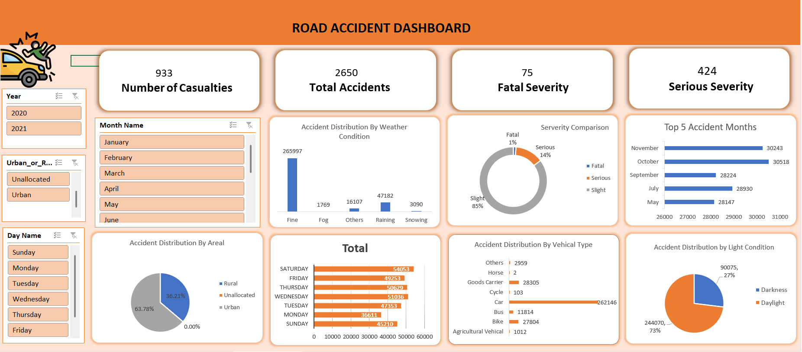

# Road Accident Dashboard

## Project Overview

This project analyzes road accident data to understand accident trends, severity levels, and contributing factors such as weather conditions, vehicle types, and lighting conditions. The dashboard provides an interactive view of accident statistics using Excel data visualization techniques.

## Objectives

* Analyze total accidents and number of casualties
* Understand accident severity distribution
* Identify accident patterns based on weather conditions
* Compare accident distribution across vehicle types
* Analyze accidents by light conditions and area type

## Tools & Technologies

* Microsoft Excel
* Pivot Tables
* Pivot Charts
* Data Cleaning
* Interactive Dashboard using Slicers

## Dataset Description

The dataset contains road accident information including:

* Year of accident
* Month of accident
* Day of accident
* Urban or Rural area
* Weather conditions
* Vehicle type
* Light conditions
* Accident severity
* Number of casualties

## Dashboard Features

**Key Performance Indicators (KPIs)**

* Total Accidents
* Number of Casualties
* Fatal Severity Cases
* Serious Severity Cases

**Interactive Filters**

* Year
* Month Name
* Day Name
* Urban or Rural Area

**Visual Analysis**

* Accident distribution by weather condition
* Accident severity comparison (Fatal, Serious, Slight)
* Top 5 accident months
* Accident distribution by area type
* Accident distribution by vehicle type
* Accident distribution by light conditions
* Accidents by day of the week

## Key Insights

* Cars are involved in the highest number of road accidents.
* Most accidents occur during clear weather conditions.
* Slight severity accidents make up the largest proportion of cases.
* Daylight conditions have more accidents compared to darkness.
* Accident frequency varies across different months and days.

## Dashboard Preview

## Repository Contents

* `road_accident_dashboard.xlsx` – Interactive Excel dashboard
* `accident_dataset.csv` – Dataset used for analysis
* `dashboard_preview.png` – Dashboard screenshot
* `README.md` – Project documentation

## Conclusion

This project demonstrates how accident data can be analyzed and visualized using Excel dashboards to identify patterns and support better decision-making for road safety analysis.

## Author

Sanket Fuke
Computer Science Engineering Student
Aspiring Data Analyst

